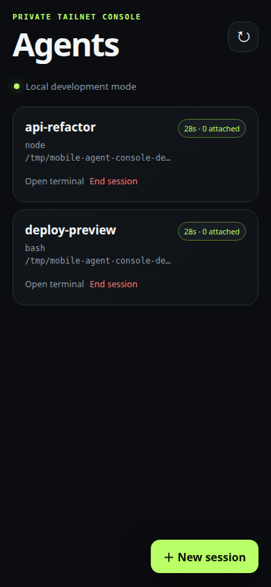
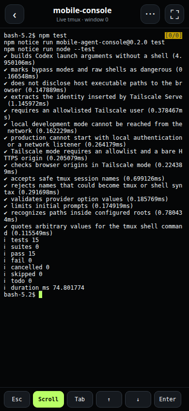

# Mobile Agent Console

A small, self-hosted mobile UI for Codex, Claude Code, shells, and other
terminal agents running in tmux.

<table>
  <tr>
    <th>Session list</th>
    <th>Active session</th>
  </tr>
  <tr>
    <td></td>
    <td></td>
  </tr>
</table>

## Why

I built this because [Codex Remote](https://learn.chatgpt.com/docs/remote) in the
ChatGPT mobile app currently requires a connected Mac or Windows PC, while my
Codex sessions run on Ubuntu. I wanted access to the exact Codex, Claude Code,
or shell TUI already running in tmux, so I made this thin Tailscale wrapper. If
you have the same gap in your workflow, it may be useful to you too.

Start an agent at your desk, then safely reconnect from your phone to answer an
approval prompt, check a deploy, or continue the full terminal session. The
agent keeps running in tmux when the browser disconnects.

The console can:

- list, open, create, and stop named tmux sessions;
- launch an agent in a selected project with a model and permission profile;
- stream the real terminal UI through xterm.js and WebSockets;
- switch Codex and Claude sessions to a filtered conversation view that shows
  user and assistant text without tool runs, reasoning, command output, or diffs,
  and send new messages from the same view;
- type directly in the terminal or open an optional text composer, with the key
  row and composer lifting above the on-screen keyboard;
- scroll inside fullscreen agent TUIs or through ordinary tmux history, with
  quick controls and common or custom `Ctrl-B` commands;
- reconnect automatically after brief network changes while keeping unsent text
  in the current browser tab; and
- install as a standalone web app without caching terminal or conversation data;
- show whether the active agent is working or waiting, with optional generic
  notifications for completed turns and terminal attention bells.

Scrolling follows whichever layer owns the history. Fullscreen TUIs receive
mouse events when they request mouse tracking, or Page Up/Down when they keep
history internally without mouse tracking; a normal shell falls back to tmux
copy mode. A flick keeps coasting, and the server refreshes tmux state so copy
mode can always be exited cleanly. **Scroll** moves the active history layer or
exits tmux copy mode. The key row also provides **← ↑ ↓ →**, while **⋯** contains
Page Up/Down, Ctrl-C, Codex's **Shift+←** queued-question shortcut, tmux commands,
and the optional text composer.

Use the **Chat / Terminal** button in the session header to switch active Codex
and Claude Code sessions between views. Conversation view reads their local
session history as the service user and returns only allowlisted message types;
raw shells and unknown transcript formats stay in terminal mode. Its message
field opens automatically: press **Enter** to send or **Shift+Enter** for a new
line. Replies use a small safe Markdown subset, and the view includes timestamps,
copy, search, and a jump-to-latest control. Sent text appears immediately and is
reconciled when the provider records the matching turn.

> [!CAUTION]
> This is interactive shell access as the Unix user running the service. Use
> Tailscale Serve, never Funnel or a public reverse proxy. Read
> [SECURITY.md](SECURITY.md) before deploying.

## Requirements

- Linux with systemd user services
- Node.js 22.13+, tmux, and Tailscale with tailnet HTTPS enabled
- Codex, Claude Code, or another terminal agent

Optional built-in agents can be installed with:

```bash
npm install --global @openai/codex @anthropic-ai/claude-code
```

Authenticate each agent using its own official CLI. Credentials remain outside
this repository.

## Install

```bash
git clone https://github.com/Adriaeik/mobile-agent-console.git
cd mobile-agent-console
mkdir -p ~/.config/mobile-agent-console
cp .env.example ~/.config/mobile-agent-console/env
chmod 600 ~/.config/mobile-agent-console/env
${EDITOR:-nano} ~/.config/mobile-agent-console/env
```

Change these three settings:

- `ALLOWED_TAILSCALE_USERS`: exact Tailscale login, or a comma-separated list;
- `PUBLIC_ORIGIN`: this machine's tailnet URL, including its HTTPS port; and
- `ALLOWED_ROOTS`: project directories the console may access, separated by
  colons.

Then run:

```bash
./scripts/setup.sh
```

The script validates the config, installs locked dependencies and a systemd
user service, then adds a dedicated Tailscale Serve listener. Port 8443 is the
default; an existing listener is never overwritten.

If the service must survive logout, enable lingering once:

```bash
sudo loginctl enable-linger "$USER"
```

Configuration stays in `~/.config/mobile-agent-console/env`, outside Git. See
[.env.example](.env.example) for optional ports, tmux socket isolation, and
custom provider configuration. `TMUX_MOUSE=on` is the default because tmux must
forward mouse-wheel events to fullscreen TUIs. A provider example lives in
[config/providers.example.json](config/providers.example.json).

## Security defaults

- loopback-only backend behind Tailscale Serve;
- explicit Tailscale identity allowlist and exact browser-origin checks;
- canonical project paths restricted to `ALLOWED_ROOTS`;
- validated session, provider, model, and permission values; and
- separate confirmation for raw-shell and sandbox-bypass modes.

Production refuses local authentication and non-loopback listeners.

## Development

```bash
npm ci
npm run dev
# open http://127.0.0.1:3210
```

```bash
npm test
npm run check
npm audit --omit=dev
```

The browser harnesses use an isolated port and tmux socket:

```bash
node scripts/e2e-scroll.mjs       # shell and tmux-history fallback
node scripts/e2e-tui-scroll.mjs   # authenticated local Codex and Claude TUIs
node scripts/e2e-reliability.mjs  # reconnect, drafts, deployment changes, PWA
```

Useful production checks:

```bash
systemctl --user status mobile-agent-console
journalctl --user -u mobile-agent-console -f
tailscale serve status
```

## License and references

[MIT](LICENSE) · [Codex commands](https://developers.openai.com/codex/cli/reference)
· [Codex TUI bindings](https://github.com/openai/codex/blob/main/codex-rs/tui/src/chatwidget.rs)
· [Claude Code fullscreen](https://code.claude.com/docs/en/fullscreen)
· [Tailscale Serve](https://tailscale.com/docs/features/tailscale-serve)
